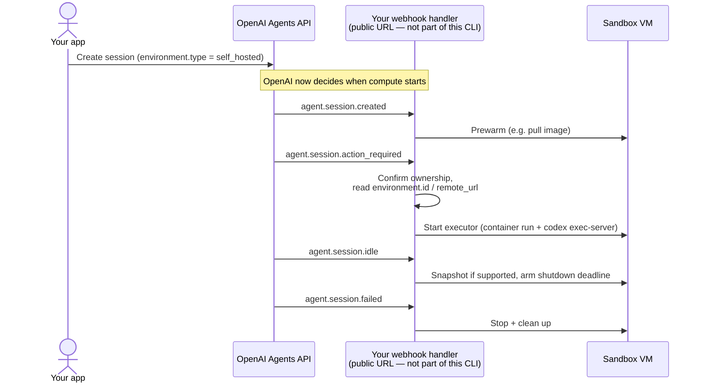
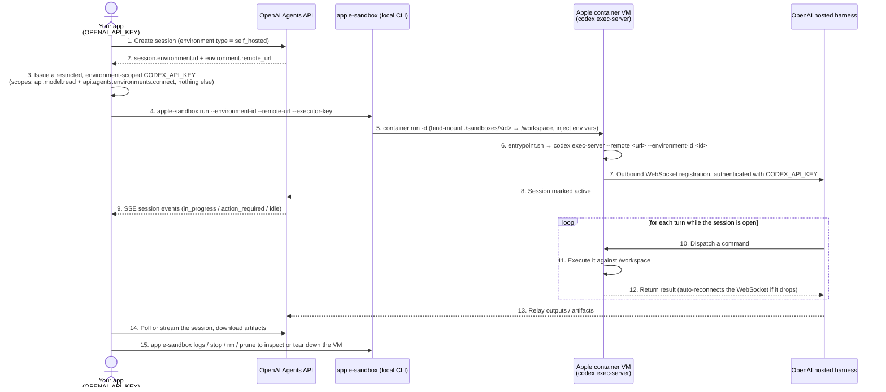
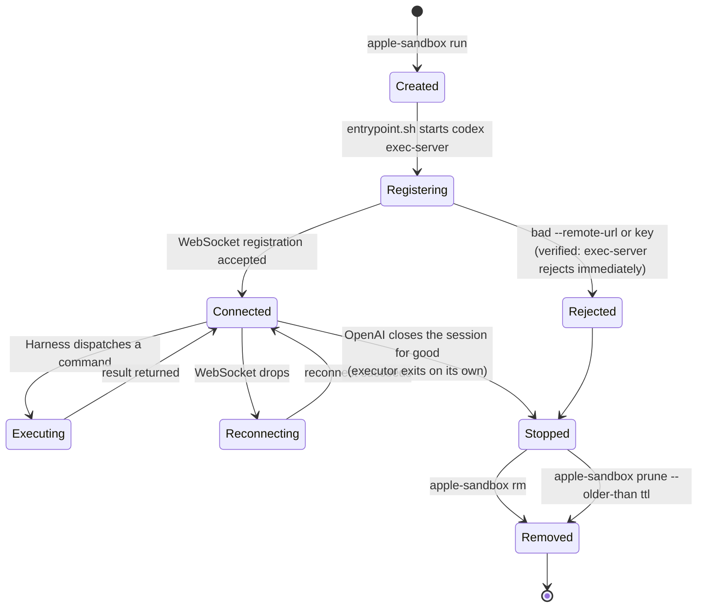

# apple-sandbox

A no-daemon CLI that runs OpenAI Agents API [self-hosted executors](https://developers.openai.com/api/docs/guides/agents-api/environments/self-hosted)
(`codex exec-server`) inside isolated VMs, using [Apple `container`](https://github.com/apple/container)
as the runtime. Each sandbox session is one OCI container = one lightweight
Virtualization.framework VM.

## Status

MVP, but **the full round trip is verified against a real, live Agents API
session** — not just the local container lifecycle:

- `run` → `ls` → `logs` → `stop` → `rm` lifecycle works end-to-end against
  Apple `container` on this machine.
- `prune` correctly distinguishes dry-run vs. real removal and respects
  `--older-than`, tested against a real stopped session (verified via
  `container inspect`'s `startedDate`, which is a Cocoa reference-date
  timestamp — seconds since 2001-01-01T00:00:00Z, not Unix epoch).
- **End-to-end CSV task, run for real**: created a real self-hosted session
  (`POST /v1/agents/sessions`), started `apple-sandbox run` with a properly
  `api.agents.environments.connect`-scoped key, dropped a CSV into the
  bind-mounted workspace, submitted "analyze this CSV and write summary
  stats to `/workspace/outputs/summary.json`" via the Agents API, and the
  file showed up in `./sandboxes/<session-id>/outputs/summary.json` on the
  host — `{"rows": 4, "total": 75, "verified": true}`, matching the agent's
  own reported output exactly. Session went `idle → in_progress → idle`;
  torn down cleanly afterward (`apple-sandbox stop/rm` + `DELETE
  /v1/agents/sessions/{id}`).
- That first successful run followed two failed attempts that each surfaced
  a real, previously-undocumented bug:
  - The executor image (`node:22-slim`) shipped without a usable CA trust
    store, so outbound TLS to `api.openai.com` failed with "unable to get
    local issuer certificate." Fixed by installing `ca-certificates` in the
    [Dockerfile](image/executor/Dockerfile).
  - The Agents API event type for submitting input is
    `agent.session.input.message`, not `session.input.message` as earlier
    research (and an earlier version of this README) had it — confirmed by
    a real `400 invalid_request_error` naming the three actually-supported
    values.
  - `session.environment.remote_url` is an `https://api.openai.com/...`
    URL, not `wss://codex-cloud-environments.chatgpt.com` as earlier
    research assumed. Whether `codex-cloud-environments.chatgpt.com` is used
    for anything else is still unconfirmed — see
    [Known gaps](#known-gaps-not-in-this-mvp).
  - A regular project `OPENAI_API_KEY` used as the executor key fails
    registration with a real `403 Forbidden: missing required scope
    api.agents.environments.connect` — the scope requirement in
    [Integrating with the OpenAI Agents API](#integrating-with-the-openai-agents-api)
    is server-enforced, not just documented practice.
  - The bind mount is confirmed live/real-time in both directions: a file
    written on the host with a plain `cat >` appeared instantly via
    `container exec ... cat /workspace/...`, no restart needed.

### Known gaps (not in this MVP)

- **No egress allowlisting.** Apple `container` networks only support
  `--internal` (host-only) or open egress — there's no domain allowlist
  primitive. This sandbox currently gives the executor full outbound network
  access rather than restricting it to the hosts it actually needs — confirmed
  so far to include `api.openai.com` (real registration traffic observed
  going there); whether anything else is needed post-registration is still
  unconfirmed. Don't use this for untrusted workloads until a proxy/allowlist
  layer is added.
- **No daemon / SDK.** This is CLI-only for now; a TS/Python SDK would just
  wrap these same subprocess calls.
- **`prune` uses a heuristic for session age, not ground truth.** It reads
  each stopped container's start time from `container inspect` — there's no
  API call back to OpenAI to confirm the session actually ended. In practice
  this is safe: the executor only reaches "stopped" once OpenAI permanently
  closes its connection (it reconnects on transient drops), so a stopped
  container already means the session is over. See
  [Integrating with the OpenAI Agents API](#integrating-with-the-openai-agents-api)
  for why this — rather than a webhook receiver — is the right amount of
  automation for this CLI's provisioning mode.

## Prerequisites

- Apple Silicon Mac, macOS with Apple `container` installed
  (`brew install --cask container`) and its services started
  (`container system start`).

Run `apple-sandbox doctor` to check all of the above plus free disk space.

## Install

Download the latest `darwin_arm64` release from
[Releases](https://github.com/sugarforever/apple-sandbox/releases) (there's
nothing else to build for — Apple `container` doesn't run on any other
platform):

```bash
curl -sL "https://api.github.com/repos/sugarforever/apple-sandbox/releases/latest" \
  | grep -o '"browser_download_url": *"[^"]*darwin_arm64\.tar\.gz"' \
  | cut -d '"' -f4 \
  | xargs curl -sL \
  | tar xz -C /usr/local/bin apple-sandbox
```

Or build from source (needs Go 1.27+):

```bash
go build -o bin/apple-sandbox ./cmd/apple-sandbox
```

## Integrating with the OpenAI Agents API

`apple-sandbox` starts the VM and the executor inside it; everything about
sessions, agents, and events is between your app and OpenAI directly. Full
protocol: OpenAI's [self-hosted sandboxes guide](https://developers.openai.com/api/docs/guides/agents-api/environments/self-hosted).
The clearest worked example of the whole flow today is Cloudflare's own
[OpenAI Agents API tutorial](https://developers.cloudflare.com/sandbox/tutorials/openai-agents-api/) —
it targets Cloudflare Containers rather than Apple `container`, but the
Agents API side (session creation, webhook events, key scopes) is identical.

### 1. Create a self-hosted session

The agent is created inline with the session, in one call — not as a
separate `POST /v1/agents` step referenced by `agent_id`. (An earlier
version of this doc showed a two-step flow; this one-step shape is what a
real `201` response actually confirmed.)

```bash
curl https://api.openai.com/v1/agents/sessions \
  --request POST \
  --header "OpenAI-Beta: agents=v1" \
  --header "Authorization: Bearer $OPENAI_API_KEY" \
  --header "Content-Type: application/json" \
  --data '{
    "agent": {"model": "<model>", "instructions": "<instructions>"},
    "environment": {"type": "self_hosted", "workspace_directory": "/workspace"}
  }'
```

The response carries the session id (`sess_...`) plus the environment's `id`
and `remote_url` — these are exactly the `--environment-id` and
`--remote-url` values `apple-sandbox run` expects below.
`remote_url` is an `https://api.openai.com/v1/agents/api/connect/...` URL
(confirmed from a real response) — not the `wss://codex-cloud-environments.chatgpt.com`
host cited in earlier research; pass it through unchanged either way.

### 2. Issue a restricted executor key

From the OpenAI Platform, create a key scoped to exactly:

- `api.model.read`
- `api.agents.environments.connect`

Nothing else. This becomes `--executor-key` — the container's `CODEX_API_KEY`
— and must never be your app's own `OPENAI_API_KEY`. This isn't a
recommendation to be careful with, it's an enforced check: registering with
a regular project `OPENAI_API_KEY` gets a real `403 Forbidden: missing
required scope api.agents.environments.connect` from OpenAI.

### 3. Start the sandbox, then drive the session normally

```bash
apple-sandbox run \
  --environment-id <environment.id from step 1> \
  --remote-url <environment.remote_url from step 1> \
  --executor-key <restricted key from step 2>
```

Session input goes through the Agents API itself, not through this CLI —
this exact call, `agent.session.input.message` included, is what actually
worked in the CSV test above (`session.input.message` gets a `400`):

```bash
curl https://api.openai.com/v1/agents/sessions/$SESSION_ID/events \
  --request POST \
  --header "OpenAI-Beta: agents=v1" \
  --header "Authorization: Bearer $OPENAI_API_KEY" \
  --header "Content-Type: application/json" \
  --data '{"events": [{"type": "agent.session.input.message",
    "input": [{"role": "user", "content": [{"type": "input_text", "text": "..."}]}]}]}'
```

Files work the same way this whole CLI does: `/workspace` is a bind mount,
so an input CSV just needs to be dropped into
`./sandboxes/<session-id>/` on the host, and an output file the agent writes
(e.g. to `/workspace/outputs/`) appears there immediately — no upload or
download API call in either direction. This isn't just the simplest option,
it's the *only* one: `openai_hosted` sessions accept an inline
`environment.files: [{type: "inline", path, data: base64}]` array at
creation time, but sending that same field on a `self_hosted` session gets
a real `400 Unknown parameter: 'environment.files'` — OpenAI rejects it at
the schema level, it's not just undocumented. (Output artifacts are
similarly hosted-only: self-hosted artifacts are explicitly *not* published
through OpenAI's Artifacts API. See the
[self-hosted sandboxes guide](https://developers.openai.com/api/docs/guides/agents-api/environments/self-hosted).)

### Provisioning modes: this CLI is "application-managed," on purpose

OpenAI's own self-hosted sandboxes docs describe **two equally first-class
ways** to provision the executor — every provider guide checked (Cloudflare,
Vercel, Modal) documents both as a deliberate choice, not a fallback:

| Mode | How it starts the executor | Needs a public URL? |
|---|---|---|
| **Application-managed** | Your app starts compute itself, synchronously, right when it creates the session | No |
| **Webhook-managed** | OpenAI pushes `agent.session.*` events to a handler you deploy, which starts/reconnects compute on demand | Yes — OpenAI has to reach your endpoint |

`apple-sandbox` implements the left column — see the full sequence in
[How it works](#how-it-works) below. The right column is what you'd build
*instead*, not something this CLI is missing; shown here only for contrast,
since it's the shape of Cloudflare's/Vercel's/Modal's reference
implementations:



`apple-sandbox run` is a straightforward implementation of **application-managed**
provisioning: your app creates the session, gets `environment.id` /
`remote_url` back, and calls `apple-sandbox run` right then. That's the
officially-supported pattern, not a workaround standing in for the "real"
webhook approach — webhook-managed exists for a different problem (start
compute only when OpenAI actually needs it, at scale) that a single-developer
CLI on a personal Mac doesn't have.

**Connections are outbound-only either way.** The executor initiates the
WebSocket to OpenAI and reconnects on drops; OpenAI never calls into your
machine for the actual command/result exchange. A public URL is *only*
needed if you additionally choose webhook-managed provisioning.

What application-managed mode does still leave to you: noticing when a
session is over and tearing the container down. `apple-sandbox` doesn't poll
OpenAI's API for this — it doesn't need to. The executor process itself
exits once OpenAI closes the connection for good (as opposed to a transient
drop, which it reconnects through), which leaves the container in `stopped`
state. `apple-sandbox prune --older-than 1h` (or any TTL) then cleans those
up — run it by hand, or on a schedule via `launchd`/`cron`:

```bash
apple-sandbox prune --older-than 1h        # remove
apple-sandbox prune --older-than 1h --dry-run   # preview first
```

`prune` never touches running containers — only ones Apple `container`
itself already reports as `stopped`.

## Usage

```bash
# 1. Check the environment
./bin/apple-sandbox doctor

# 2. Build the executor image (Node + codex)
./bin/apple-sandbox build

# 3. Start a session (environment-id / remote-url / executor-key come from
#    the Integrating section above)
./bin/apple-sandbox run \
  --environment-id env_xxx \
  --remote-url https://<agents-api-remote-url> \
  --executor-key <restricted-CODEX_API_KEY>

# 4. Watch it
./bin/apple-sandbox logs -f <session-id>

# 5. List / stop / remove
./bin/apple-sandbox ls
./bin/apple-sandbox stop <session-id>
./bin/apple-sandbox rm <session-id>

# 6. Or clean up everything already stopped and old enough, instead of
#    tracking individual session ids
./bin/apple-sandbox prune --older-than 1h
```

Each session's `/workspace` is a bind mount of
`./sandboxes/<session-id>/` on the host — that host directory is the durable
state; the container itself is disposable (`rm` after `stop`).

## How it works

`apple-sandbox` only ever plays one role in this flow: turning an
`environment.id` / `remote_url` / restricted key — which your app obtains
from the Agents API itself — into a running `codex exec-server` inside an
Apple `container` VM. It never talks to OpenAI directly.



Two things worth noting from that diagram:

- **Steps 1–3 and 9–14 happen entirely between your app and OpenAI** —
  `apple-sandbox` is invisible to them. It only exists to do step 5 (start
  the VM) and step 6 (launch the executor inside it) correctly, then get out
  of the way while 7–12 run over the executor's own outbound WebSocket.
- **Step 7 is the network requirement to lock down**: `api.openai.com` is
  confirmed (real registration traffic observed going there); whether
  anything else is needed post-registration is still unconfirmed, see
  [Status](#status). As noted in [Known gaps](#known-gaps-not-in-this-mvp),
  this sandbox doesn't yet restrict egress to just what's needed.

### Session lifecycle

The states the sandbox itself moves through. Two paths are now confirmed
end-to-end, not just read about: `Created → Registering → Rejected →
Stopped` (a bogus `--remote-url`, rejection surfaced verbatim through
`apple-sandbox logs`) and `Created → Registering → Connected → Executing →
Connected` (a real CSV analysis task, dispatched and completed — see
[Status](#status)). What's still *not* directly observed is the `Connected
→ Stopped` transition specifically — the executor exiting on its own once
OpenAI closes the session for good, rather than being stopped by hand. Our
CSV test ended with `apple-sandbox stop` after the session went `idle`, not
by watching the container exit on its own. `prune`'s safety still rests on
that one inference from OpenAI's docs ("the executor reconnects if the
connection drops," implying it doesn't when the drop is final) holding.



`Reconnecting` is handled entirely inside `codex exec-server` — it's the
executor's own outbound WebSocket retrying, not anything `apple-sandbox`
does. From the CLI's point of view a session is only ever `running` or
`stopped` (what `apple-sandbox ls` reports); everything between `Created`
and `Stopped` happens inside the VM.

### Local CLI mechanics

What `apple-sandbox run` actually shells out to, for steps 4–6 above:

```
apple-sandbox run
  → creates ./sandboxes/<session-id>/ (host dir, bind-mounted to /workspace)
  → container run -d --name apple-sandbox-<session-id> \
      -v <workspace>:/workspace \
      -e CODEX_API_KEY=... -e OPENAI_ENVIRONMENT_ID=... -e OPENAI_REMOTE_URL=... \
      apple-sandbox-executor:latest
       → entrypoint.sh → codex exec-server --remote ... --environment-id ...
            → outbound WebSocket to OpenAI's hosted harness
```

No daemon, no control-plane process: `apple-sandbox` shells out to the
`container` CLI directly, and the container survives (not `--rm`) after
stopping so `logs` remains available for debugging a crashed executor.

## Releasing

Releases are built by [GoReleaser](https://goreleaser.com/) via
[`.github/workflows/release.yml`](.github/workflows/release.yml), triggered
by pushing a semver tag:

```bash
git tag v0.1.0
git push origin v0.1.0
```

That produces a GitHub Release with the `darwin_arm64` archive, a
`checksums.txt`, and an auto-generated changelog (grouped by
`feat:`/`fix:` commit prefixes). [`.github/workflows/ci.yml`](.github/workflows/ci.yml)
runs `gofmt`, `go vet`, `go build`, and a GoReleaser snapshot build (no
publish) on every push/PR to `main`, so a broken release config fails CI
before it ever fails a real tag push.

To dry-run a release locally: `goreleaser release --snapshot --clean --skip=publish`.
